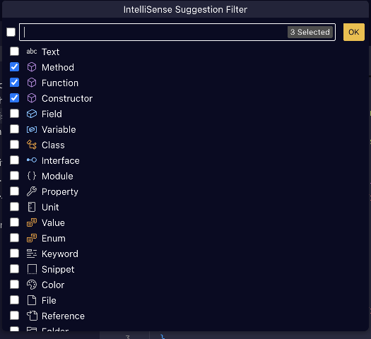

# IntelliSenseFilter

VSCode extension for filtering items in suggestions by their kind.

## Features

### Commands

- `intellisensefilter.toggle` - toggles chosen item kinds
- `intellisensefilter.singleOut` - disables all kinds except the chosen ones
- `intellisensefilter.enableAll` - enables all kinds

### Shortcuts

The only command available in the Command Palette is the Quick Pick, however
you can define keyboard shortcuts for the actions in your `keybindings.json`
file, for example:

```json
{
  "key": "cmd+' cmd+f",
  "command": "intellisensefilter.singleOut",
  "args": ["Function", "Method"]
},
{
  "key": "cmd+' cmd+s",
  "command": "intellisensefilter.toggle",
  "args": ["Snippet"]
},
{
  "key": "cmd+' cmd+a",
  "command": "intellisensefilter.enableAll",
},
{
  "key": "cmd+' cmd+'",
  "command": "intellisensefilter.pick",
}
```

### Quick Pick



## Known Issues

- The extension works by changing the settings which triggers `settings.json`
  update, so the filter change takes effect after ~1-2 seconds
